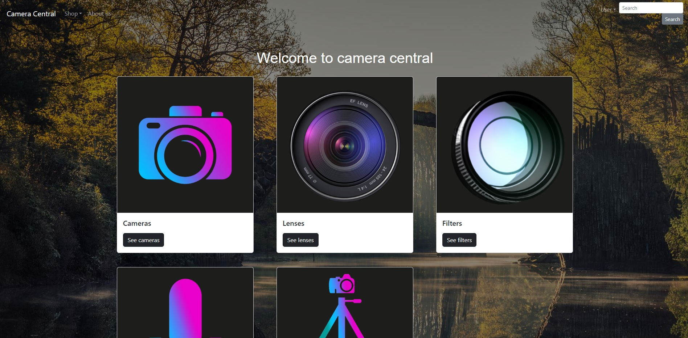

# Vue-frontend-for-Camera-shop
This is a Vue front end application for one of my existing backend projects - Camera shop. 
 
Home page:

 
About us page:
The questions you see at the bottom we're realised using a websocket. What this means is if there are two users on
this page at the same time and one of them posts a question, the other user will see it being added in real time 
without having to refresh the page. 

 
The different pages for buying camera equipment look like this as well:

 
The login page:

 
The register page:

